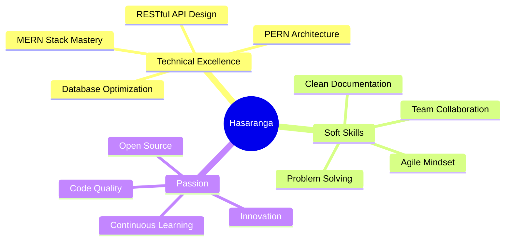

<div align="center">

# 👨‍💻 Hasaranga Navoda

### Full Stack JavaScript Developer | MERN & PERN Specialist

[](https://git.io/typing-svg)

<p align="center">
  <a href="https://www.linkedin.com/in/hasarangamn/"></a>
  <a href="mailto:hasaranganavoda2025@gmail.com"></a>
  <a href="https://stackoverflow.com/users/32285714/hasaranga"></a>
  <a href="https://www.facebook.com/"></a>
</p>


</div>

---

## 🎯 About Me

```typescript
const hasaranga = {
  role: "Full Stack JavaScript Developer",
  education: "Computer Science @ SLIIT",
  location: "Sri Lanka 🇱🇰",
  
  expertise: {
    backend: ["Node.js", "Express.js", "PostgreSQL", "MongoDB"],
    frontend: ["React.js", "Next.js", "TailwindCSS", "TypeScript"],
    mobile: ["Kotlin", "Android Studio"],
    architecture: ["REST APIs", "MVC", "Microservices"]
  },
  
  currentFocus: [
    "Building production-ready MERN & PERN applications",
    "Advanced React patterns & optimization",
    "Scalable Node.js backend architecture",
    "Mobile-first responsive design"
  ],
  
  codePhilosophy: "Clean code, performant solutions, user-centric design",
  
  available: true,
  openTo: ["Full-time roles", "Freelance projects", "Collaborations"]
};
```

<div align="center">
  
### 💡 Core Competencies

<table>
  <tr>
    <td align="center" width="25%">
      
      <br><strong>Backend Development</strong>
      <br><sub>Node.js | Express | APIs</sub>
    </td>
    <td align="center" width="25%">
      
      <br><strong>Frontend Development</strong>
      <br><sub>React | Next.js | Modern UI</sub>
    </td>
    <td align="center" width="25%">
      
      <br><strong>Database Design</strong>
      <br><sub>PostgreSQL | MongoDB</sub>
    </td>
    <td align="center" width="25%">
      
      <br><strong>Mobile Development</strong>
      <br><sub>Kotlin | Android</sub>
    </td>
  </tr>
</table>

</div>

---

## 🛠️ Technology Arsenal

<div align="center">

### 💻 Languages & Core Technologies

<p>
  
</p>

### ⚡ JavaScript Ecosystem (Primary Focus)

<table>
  <tr>
    <td align="center" width="33%">
      <strong>🎨 Frontend</strong><br><br>
      <br>
      <sub>React • Next.js • TailwindCSS • Bootstrap</sub>
    </td>
    <td align="center" width="33%">
      <strong>⚙️ Backend</strong><br><br>
      <br>
      <sub>Node.js • Express • PostgreSQL • MongoDB</sub>
    </td>
    <td align="center" width="33%">
      <strong>🔧 Tools & More</strong><br><br>
      <br>
      <sub>Firebase • Postman • VS Code • Git</sub>
    </td>
  </tr>
</table>

### 📱 Mobile Development

<p>
  
</p>

### 🌐 Hosting & Deployment

<p>
  
  
</p>

### 💻 Development Environment

<p>
  
</p>

</div>

---

## 📊 GitHub Performance

<div align="center">
  
  
</div>

<div align="center">
  
  
</div>

<div align="center">
  
</div>

---

## 🏆 Achievements & Highlights

<div align="center">
  


</div>

---

## 📈 Coding Activity

<div align="center">

<!--START_SECTION:waka-->
```text
JavaScript   12 hrs 45 mins  ██████████████░░░░░░░   52.8%
React        6 hrs 20 mins   ███████░░░░░░░░░░░░░░░   26.2%
Node.js      3 hrs 15 mins   ███░░░░░░░░░░░░░░░░░░░   13.5%
TypeScript   1 hr 30 mins    █░░░░░░░░░░░░░░░░░░░░░    6.2%
Other        20 mins         ░░░░░░░░░░░░░░░░░░░░░░    1.3%
```
<!--END_SECTION:waka-->

</div>

---

## 🎯 What I Bring to the Table

<div align="center">



</div>

---

## 🤝 Let's Connect & Collaborate

<div align="center">

### 💼 Open for Opportunities | Let's Build Something Amazing Together

<p>
  <a href="https://www.linkedin.com/in/hasarangamn/">
    
  </a>
  <a href="mailto:hasaranganavoda2025@gmail.com">
    
  </a>
</p>


<p align="center">
  
</p>

### ⭐ If you find my work interesting, consider starring my repositories!

</div>


